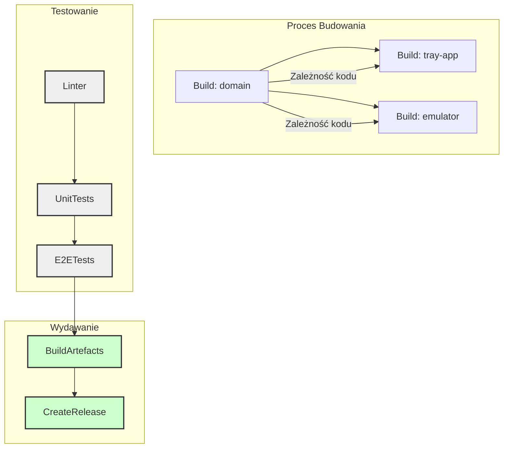

# Architektura Procesu Budowania i CI/CD

Ten dokument opisuje zautomatyzowany proces budowania, testowania i wydawania aplikacji WFH Indicator. Architektura ta jest zaprojektowana z myślą o wykorzystaniu w środowiskach CI/CD, takich jak GitHub Actions.

## Kluczowe Komponenty

1.  **`domain`**: Współdzielona biblioteka z logiką biznesową i typami. Musi być skompilowana z TypeScript do JavaScript przed użyciem przez inne pakiety.
2.  **`emulator`**: Aplikacja konsolowa do symulowania urządzenia hardware'owego (np. LED). Używana głównie do testów i dewelopmentu.
3.  **`tray-app`**: Główna aplikacja desktopowa (Electron), która jest produktem końcowym dla użytkownika.

## Zależności Między Projektami



## Przepływ Pracy (Workflow)

### 1. Faza: Instalacja i Przygotowanie

- **Cel**: Przygotowanie środowiska i instalacja wszystkich zależności.
- **Kroki**:
  1.  Pobranie kodu źródłowego.
  2.  Instalacja `pnpm`.
  3.  Uruchomienie `pnpm install` w głównym katalogu, aby zainstalować wszystkie zależności dla wszystkich pakietów w monorepo.

### 2. Faza: Linting i Jakość Kodu

- **Cel**: Weryfikacja spójności i jakości kodu.
- **Kroki**:
  1.  Uruchomienie `pnpm lint` w całym projekcie, aby sprawdzić błędy i styl kodu.

### 3. Faza: Budowanie Zależności (Build)

- **Cel**: Kompilacja pakietów i przygotowanie artefaktów.
- **Kluczowa zasada**: `pnpm` automatycznie zarządza kolejnością budowania dzięki zdefiniowanym zależnościom `workspace:`.
- **Kroki**:
  1.  **Automatyczne budowanie `domain`**: `pnpm` wykryje, że `tray-app` i `emulator` zależą od `domain`, i automatycznie uruchomi dla niego skrypt `build` jako pierwszy.
  2.  **Budowanie `tray-app`**: Uruchomienie skryptu `make` lub `package` w `tray-app`, który stworzy pliki wykonywalne (np. `.exe`, `.dmg`).
  3.  **Budowanie `emulator`**: (Opcjonalnie, jeśli jest potrzebny w CI) Uruchomienie `build` w `emulator`.

### 4. Faza: Testowanie

- **Cel**: Weryfikacja poprawności działania aplikacji.
- **Kroki**:
  1.  **Testy jednostkowe**: Uruchomienie `pnpm test` dla wszystkich pakietów.
  2.  **Testy E2E (End-to-End)**: Uruchomienie testów Playwright (`test:e2e`) dla `tray-app`. To wymaga, aby aplikacja była wcześniej zbudowana.

### 5. Faza: Wydanie (Release)

- **Cel**: Publikacja nowej wersji aplikacji.
- **Kroki**:
  1.  **Tagowanie wersji**: Użycie `git tag` do oznaczenia nowej wersji.
  2.  **Tworzenie Release'u w GitHub**: Automatyczne utworzenie nowej wersji na GitHub.
  3.  **Publikacja Artefaktów**: Dołączenie zbudowanych plików (`.exe`, `.dmg`, `.AppImage`) do release'u na GitHub.

## Konfiguracja w `package.json`

Aby zautomatyzować budowanie `domain` przy budowaniu `tray-app`, dodamy skrypt w głównym `package.json`, który wykorzysta `--filter` od `pnpm`.

```json
// root package.json
"scripts": {
  "build": "pnpm --filter \"./packages/**\" build",
  "build:tray-app": "pnpm --filter tray-app... build",
  "make:tray-app": "pnpm --filter tray-app... make"
}
```

Użycie `...` w filtrze (`--filter tray-app...`) mówi `pnpm`, aby najpierw zbudować wszystkie zależności `tray-app` (czyli `domain`), a dopiero potem samą `tray-app`.

## Przykładowy Plik GitHub Actions (`.github/workflows/ci.yml`)

```yaml
name: CI/CD Pipeline

on:
  push:
    branches: [main]
  pull_request:
    branches: [main]

jobs:
  build-and-test:
    runs-on: ubuntu-latest
    steps:
      - uses: actions/checkout@v3

      - name: Setup pnpm
        uses: pnpm/action-setup@v2
        with:
          version: 8

      - name: Setup Node.js
        uses: actions/setup-node@v3
        with:
          node-version: "18"
          cache: "pnpm"

      - name: Install dependencies
        run: pnpm install

      - name: Lint
        run: pnpm lint

      - name: Build all packages
        run: pnpm --filter \"./**\" build

      - name: Run Unit Tests
        run: pnpm test

      - name: Build Tray App for Production
        run: pnpm --filter tray-app make

      - name: Run E2E Tests
        run: pnpm --filter tray-app test:e2e
```

Ten plik stanowi solidną podstawę dla w pełni zautomatyzowanego procesu CI/CD.
